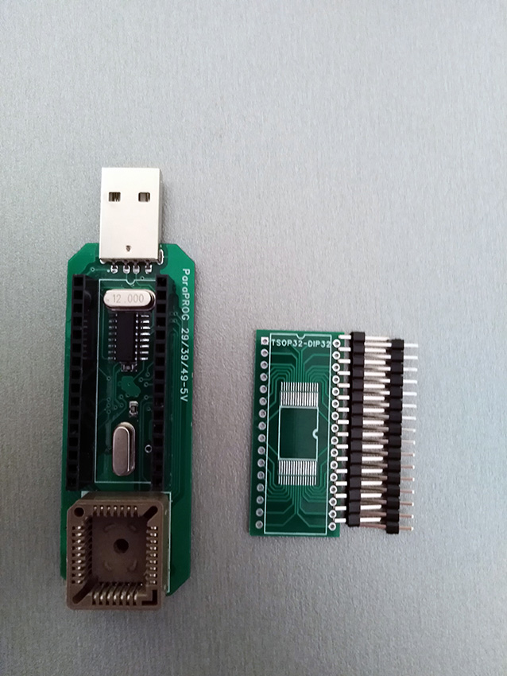
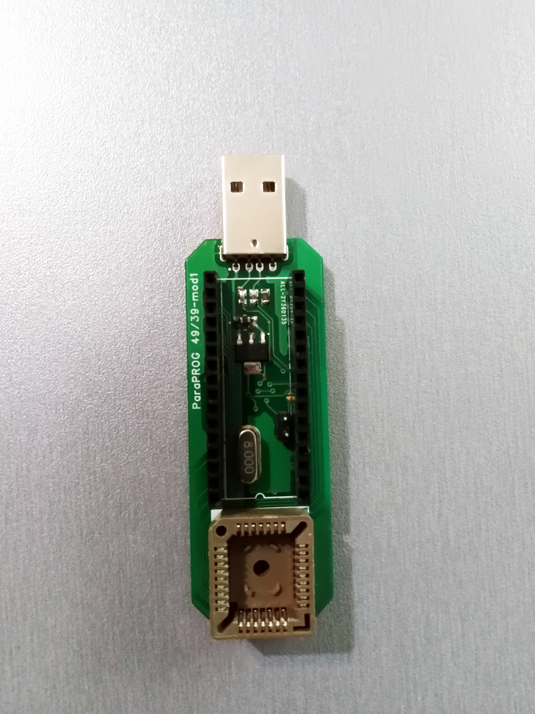
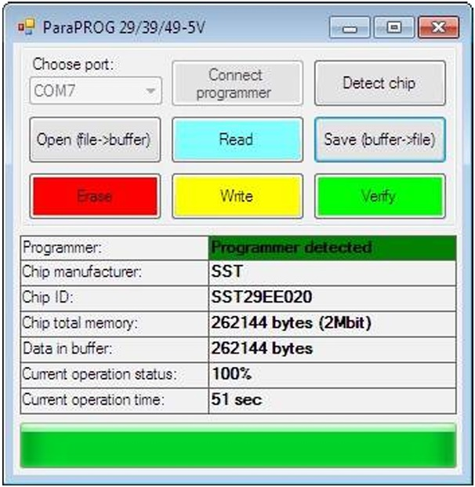
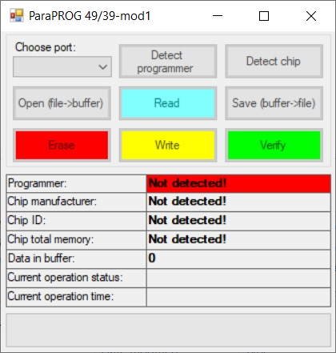

# ParaPROG
ParaPROG started in about 2018 as a simple USB programmer for older memory chips with parallel interface.
The repository includes files sufficient to reproduce hardware (schematics in PDF and KiCad, Gerber files), compiled firmware and PC application source code (C#) providing some flexibility about adding more supported devices.
The repository includes different versions of hardware/firmware for different chips (located accordingly in subfolders).

# Supported devices
Version ParaPROG 29/39/49-5V: 
---AMIC-- 
A29001 
A29010 
A29002 
A290021 
A29040 
---ATMEL-- 
AT49F512 
AT49F001(N) 
AT49F001(N)T 
AT49F002(N) 
AT49F002(N)T 
AT49F/HF010 
AT49F020 
AT49F040 
---PMC-- 
PM39F010 
PM39F020 
PM39F040 
---ALLIANCE-- 
AS29F040 
---WINBOND-- 
W49F002 
---SST-- 
SST39SF010 
SST39SF020 
SST39SF040 
 ---MXIC-- 
MX28F1000P 
MX28F2000P 
MX29F001T 
MX29F001B 
MX29F002T 
MX29F002B 
MX29F040 
---FUJITSU-- 
MBM29F002B 
MBM29F002T 
MBM29F002ST 
MBM29F002SB 
MBM29F040 
---HYNIX-- 
HY29F002T 
---AMD-- 
AM29F010 
AM29F040 

Version ParaPROG 49/39-mod1: 
---SST--- 
SST49LF002A/B 
SST49LF003A/B 
SST49LF004A/B 
SST49LF008A/B 
SST49LF004 
SST49LF004B 
SST49LF004C 
SST49LF008C 
SST49LF020 
SST49LF020A 
SST49LF030A 
SST49LF040 
SST49LF040B 
SST49LF080A 
SST49LF016C 
---STM--- 
M50LPW002 
M50LPW012 
M50LPW041 
M50LPW080 
M050FW040 
M050FW080 
M50FLW040A 
M50FLW040B 
---Winbond--- 
W49V002FA 
W49V002 
W39V040A 
W39V080A 
W39V040FA 
W39V040FB/B 
W39V040FC/C 
W39V080FA 
---ISSI--- 
Pm49FL002 
Pm49FL004 
Pm49FL008 
---Amic--- 
A49LF040 
A49LF004 
---Atmel--- 
AT49LW040 
AT49LW080 
AT49LH002 
AT49LH004 
AT49LH00B4 
---Intel--- 
82802AB 
82802AC 

## Hardware
The repository includes Gerber files of previous version of hardware (tested) and schematics in KiCad, which must be sufficient to reproduce hardware. 

KiCad layout is still under "TODO" status.

## Software
The software provides access to all basic operations as reading, erasing, writng and verifying data as well as storing memory dump to file.
All versions of device work as VCP (virtual COM port) so no specific drivers required.
Visual Studio Community Edition can be used to build or modify software. 

## Drivers & settings
The device works as VCP (Virtual COM Port) in all versions. 
For Version ParaPROG 29/39/49-5V - [VCP driver](https://www.st.com/en/development-tools/stsw-stm32102.html) from ST Microelectronics should be used.
For Version ParaPROG 49/39-mod1 - CH340 (USB-UART bridge) driver.

## Firmware
Firmware file can be found in corresponding sub-folders. The most affordable tools to flash firmware: ST-Link (for STM32 version) and USBAVR (for ATmega16 version).

## License
This project is licensed under multiple terms:
- **Hardware (KiCad design files)**: Licensed under **CERN-OHL-W-2.0**, which allows modification and commercial use with attribution.  
- **Firmware (binary-only)**: Licensed under **Apache 2.0**, but the source code is not provided. Modification or reverse-engineering is prohibited.  
- **Software**: Licensed under **MIT**. If you use this software in any form (modified or unmodified), please include a link back to the original repository.

See the  for details. 
